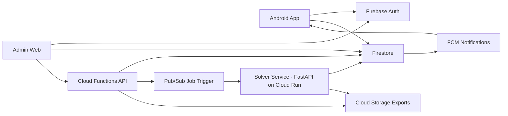

# SmartTime AI — System Architecture

## Architecture Overview
- **Client apps**: Android (teacher/student/parent), Web Admin Panel (super admin + in-charge)
- **Backend**: Firebase + Cloud Functions (Node.js)
- **Solver Service**: FastAPI container (Cloud Run) for heavy constraint solving
- **Data**: Firestore (primary), Cloud Storage (exports), optional BigQuery (analytics later)

## Key Components
1. **Firebase Auth**
   - Email/password + optional Google sign-in.
   - Custom claims for roles.

2. **Firestore**
   - School configs, entities, constraints, jobs, timetable versions, audit logs.

3. **Cloud Functions**
   - API façade, validation, role checks, orchestration, lightweight analytics aggregation.

4. **Solver Service (Cloud Run)**
   - Consumes normalized problem payload.
   - Produces solution + conflict diagnostics + score.

5. **Pub/Sub + Scheduler**
   - Async job execution, retry, timeout control.

6. **Cloud Storage**
   - Generated PDF/XLSX files.

## Security Model
- Role-based access checks in Functions + Firestore rules.
- Every override action logged with actor/time/reason.
- School-scoped data isolation via `schoolId` partition keys.

## Deployment Environments
- dev, staging, prod
- Separate Firebase projects recommended.

## Performance Strategy
- Store denormalized published views for fast mobile reads.
- Solver runs async; UI polls or subscribes to job state.
- Cache latest timetable version per role view.
